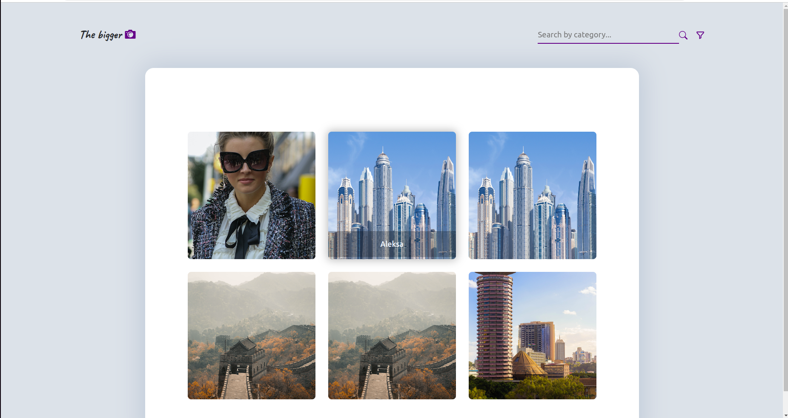

# The bigger Picture



<br>

## Table of Content

- [Description](#description)
- [Installation Requirement](#Installation)
- [Technology Used](#technology-used)
- [Licence](#licence)
- [Authors Info](#author-Info)
- [ToDO](#To-Do)


## Description

This is a sample of a gallery application that displays photos for others to see.

#  Installation 

```
$ git clone
$ python3 -m venv virtual 
$ pip install -r requirements.txt
$ pip list 

```

## Run the application using 

```
$ make / $ make serve / python3 manage.py runserver
```
## Run tests

Run test to the models
```
$ make test / python3 manage.py tests
```


## Technology Used

<ul>
<li>
python3.9.5
 </li>
  <li>
Django 
 </li>
<li>
pip3
</li>
<li>
PSQL 
</li>
<li>
Javascript
</li>
</ul>


## Licence

   copyright © Charity 2022 - <a href="https://github.com/charity-bit/gallery/blob/main/LICENSE"> MIT </a>

## Authors Info

-LinkedIn - [Charity Nyanchera](https://www.linkedin.com/in/charitynyanchera)

-twitter - [CcNyanchera](https://twitter.com/CcNyanchera)


